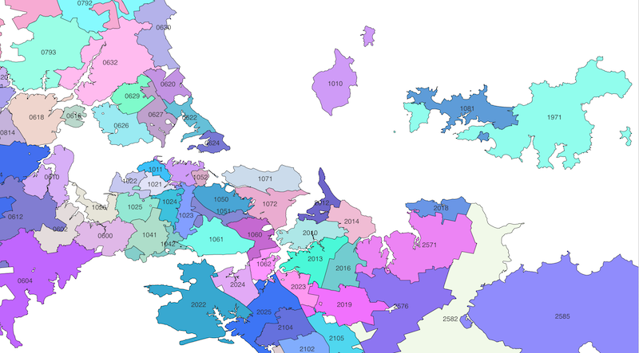
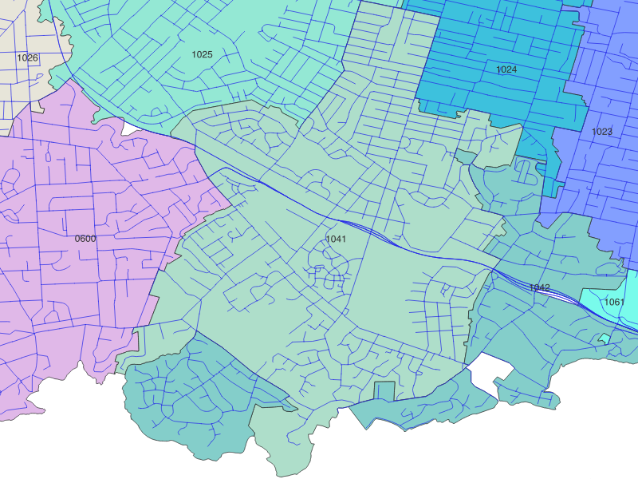

# Open NZ Postcodes

An openly licenced (unofficial) dataset of New Zealand postcodes with geospatial representation as digital boundaries.

Latest boundary shapefiles can be downloaded from "Artifacts" in the latest/top [Workflow Run](https://github.com/s01ipsist/open_nz_postcodes/actions/workflows/process-data.yml).

Boundary files are generated automatically using latest upstream data weekly via GitHub Actions.

[](https://github.com/s01ipsist/open_nz_postcodes/actions/workflows/process-data.yml)



## Context

As of mid-2024, an open data set of NZ Postcodes was the [2nd most requested dataset](https://www.data.govt.nz/requests/?AgencySearch=&StatusSearch=0&ResponseSearch=0&sortby=Votes&action_=Submit&agency=true&status=1&response=1&o=1&start=) on [data.govt.nz](https://www.data.govt.nz) but NZ Post have simply responded that the
> Address post code finder ... can be accessed via our website. [https://www.nzpost.co.nz/tools/address-postcode-finder](https://www.nzpost.co.nz/tools/address-postcode-finder)

An Official Information Act request for this data has been denied. https://fyi.org.nz/request/8955-geospatial-file-of-all-nz-postcodes

Wikipedia tells us there are [1856 postcodes in New Zealand](https://en.wikipedia.org/wiki/Postcodes_in_New_Zealand).

Approximately 700 of these are postal lobby postcodes used for [PO Boxes and Private Bags](https://www.nzpost.co.nz/personal/receiving/po-box-private-bags). Physical postcodes are those associated with residential or street addresses.

There are various freely available NZ postcode datasets:

- https://www.geonames.org/postal-codes/postal-codes-new-zealand.html
- https://www.matthewproctor.com/newzealand_postcodes

but these are limited to a list of places/localities, associated postcode(s) and a centroid geo point.

This project is an attempt to create a dataset of NZ physical postcodes with complex polygonal geospatial representation.

This project can/will be retired if/when NZ Post release an official version!

## Relevant geodata sources

There are many great open-licenced geo datasets for New Zealand. Those that could be useful for this project to develop digital boundaries include:

| Dataset        | Source        | Geo type | Count   | Postcodes per row |
|----------------|---------------|----------|---------|-------------------|
| regions        | Statistics NZ | polygon  | 16      | many              |
| localities     | LINZ          | polygon  | 7000    | many              |
| roads          | LINZ          | line     | 77000   | one or few        |
| meshblocks     | Statistics NZ | polygon  | 57000   | one or few        |
| address points | LINZ          | point    | 2300000 | one               |

Land Information New Zealand (LINZ) and Statistics NZ provide many high fidelity, open-licenced datasets but no postcodes.
- [Address points](https://data.linz.govt.nz/layer/105689-nz-addresses/). Each address point could be assigned a single postcode.
- [Roads](https://data.linz.govt.nz/layer/53382-nz-roads-addressing/). Most address points on the same road share the same postcode. Very long roads may have address points in multiple postcodes
- [Localities](https://data.linz.govt.nz/layer/113764-nz-suburbs-and-localities/). Most address points in the same locality share the same postcode
- [Meshblocks](https://datafinder.stats.govt.nz/layer/115225-meshblock-2024/). A meshblock is the smallest geographic unit for which statistical data is collected and processed by Stats NZ.
- [Regions](https://datafinder.stats.govt.nz/layer/111182-regional-council-2023-generalised/). Regional councils / [ISO-3166-2](https://en.wikipedia.org/wiki/ISO_3166-2:NZ))

Note that [postal area digital boundaries](https://www.abs.gov.au/statistics/standards/australian-statistical-geography-standard-asgs-edition-3/jul2021-jun2026/access-and-downloads/digital-boundary-files) are freely available in Australia from Australian Bureau of Statistics. 🤔

### Postcodes for Roads

This project contributes a dataset of NZ roads mapped to postcodes.
street-postcodes are captured in csv format split by first letter of road name (e.g. a.csv, b.csv), with all roads using a digit as first letter captured in 0.csv.
Where a road is identified as crossing postcode boundaries, the postcode is set to null.

## Methodology

- Using the dataset of street-postcodes, assign postcode to each address point on roads
- Assign a postcode to each meshblock polygon, based on most popular postcode of all address points in the meshblock
- Take the union of all meshblocks for each postcode to form a digital boundary

## Prerequisites

1. Download open datasets from URLs identified in import-geodata.sh and unzip into data folder
2. Install Docker
3. For snapshots: [QGIS](https://www.qgis.org/), timeout (found on MacOS in `brew install coreutils`)

## Build

Generate zipped shapefile boundary in release folder

```
docker compose run --rm app scripts/run.sh
```

Generate png snapshots per postcode boundary using QGIS.



```
cd snapshots && bash qgis_screenshots.sh && cd ..
zip -jr release/open_nz_postcode_boundaries_png.zip snapshots/*.png
```

The included QGIS project open_nz_post.qgz presents the road network on top of the postcode boundaries filled with a random color seeded by the postcode value
> Layer Properties - Symbology - Single Symbol - Simple Fill - Fill color
```
color_rgb(rand(50, 255, to_int(  attribute( 'postcode') )), rand(100, 255, to_int(  attribute( 'postcode') )), rand(200, 255, to_int(   attribute( 'postcode') )))
```

## Usage

This dataset is appropriate for non-commerical use such as educational use, or personal or private study.
With current methodology, about 5% of address points end up in a boundary with a different postcode. PRs welcome.

This dataset is likely not appropriate for addressing. The Postcode Network File is the authoritative definition of the NZ Post Postcode Network and available under commercial licence from NZ Post.
https://www.nzpost.co.nz/business/sending-within-nz/quality-addressing/postcode-network-file

## License

All assets and code are under the CC0 LICENSE and in the public domain.
https://creativecommons.org/publicdomain/zero/1.0/

- The postcode assigned to any single locality, street or address is a fact.
- [Facts are not copyrightable; although compilations of facts can be.](https://en.wikipedia.org/wiki/Feist_Publications,_Inc.,_v._Rural_Telephone_Service_Co.)

## Attribution

Uses data licensed for reuse under [CC BY 4.0 license](https://creativecommons.org/licenses/by/4.0/) from [LINZ Data Service](https://data.linz.govt.nz/) and [Stats NZ](https://www.stats.govt.nz/).

## Contributors

Thanks to www.addressable.co.nz who developed the initial project and cultivated the street-postcode dataset.
